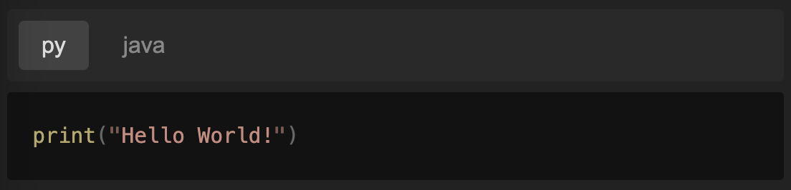

# markdown-it-tabbar

[![npm version][npm-version-src]][npm-version-href]
[![License][license-src]][license-href]

A markdown-it plugin to group anything using tabbar.

## Features



~~~ markdown
::: tabbar

@ py
``` python
print("Hello World!")
```

@ java
``` java
System.out.println("Hello World!");
```

:::
~~~

## Usage

We supply plugin, style and script for you to use.

### Install
``` sh
npm i markdown-it-tabbar
```

### Options
``` ts
import MarkdownIt from 'markdown-it'
import MarkdownItTabbar from 'markdown-it-tabbar'

const md = new MarkdownIt()
md.use(MarkdownItTabbar, {
  // if conditions below are not satisfied, the plugin will not work
  // the options below are also the default options
  // contianerMark, length === 1
  mark: ':',
  // containerMarkRepeatMin, >= 1
  min: 3,
  // titleMark, just repeat once is enough
  title: '@',
  // containerName, length >= 1
  name: 'tabbar'
})
```

### Script
You should run this script in your html file.
As an example, you can run it after mounting components in [Vue 3](https://vuejs.org/).

``` vue
<script setup lang="ts">
import { useTabbar } from 'markdown-it-tabbar'
import { onMounted } from 'vue'

onMounted(() => {
  useTabbar()
})
</script>
```

### Style

We supply a default styles for you to use.

``` ts
import 'markdown-it-tabbar/styles/base.css'
```

You can also customize the style. See [base.css](./styles/base.css) for reference.

<!-- Badges -->

[npm-version-src]: https://img.shields.io/npm/v/markdown-it-tabbar
[npm-version-href]: https://npmjs.com/package/markdown-it-tabbar
[license-src]: https://img.shields.io/github/license/howcasperwhat/markdown-it-tabbar.svg
[license-href]: https://github.com/howcasperwhat/markdown-it-tabbar/blob/main/LICENSE
